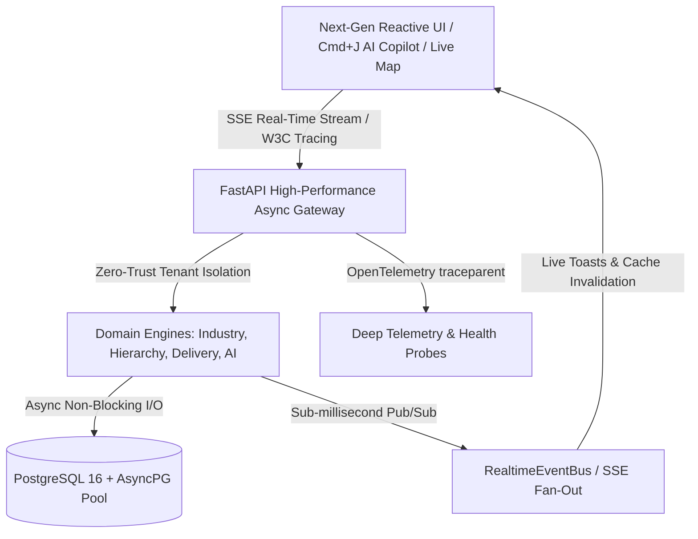

# 2026–2030 Enterprise Architectural Standards & Quality Benchmarks

> **Document Version:** 1.0.0  
> **Platform Standard:** 2026–2030 Universal Enterprise Cloud-Native Tier  
> **Status:** Production-Ready & Verified

---

## 1. Ten Core Pillars of the 2026–2030 System Flow

### 1. Real-Time Reactive Event Streaming (SSE & WebSocket Ready)
- **Standard**: Zero polling architecture. Clients maintain persistent, low-overhead HTTP Server-Sent Events (SSE) connections (`GET /api/v1/events/stream`) with automatic 15-second heartbeat keep-alive frames.
- **Tenant Channel Isolation**: Events (`SALE_COMPLETED`, `DELIVERY_DISPATCHED`, `LOW_STOCK_ALERT`, `APPROVAL_REQUIRED`) are automatically scoped to the active tenant in [`RealtimeEventBus`](file:///d:/Project/MyStore/services/backend-py/app/domain/event_bus.py).
- **Web Reactivity**: The [`useRealtimeStream`](file:///d:/Project/MyStore/apps/web/lib/use-realtime-stream.ts) hook invalidates React Query caches and surfaces immediate glassmorphic toasts with zero manual refreshes.

### 2. Micro-Second Response Envelopes & Distributed Tracing
- **W3C `traceparent` Standard**: Every inbound request receives or propagates a standard W3C trace parent header (`00-{trace_id}-{span_id}-01`).
- **Telemetry Headers**:
  - `X-Process-Time-Ms`: High-resolution server processing duration.
  - `X-Request-Id`: Globally unique request correlation UUID.
  - `X-Trace-Id`: 128-bit distributed trace ID.
- **Standardized Envelopes**: All successful responses follow `{ success: true, data: ..., requestId: ... }`, and all error responses carry machine-readable error codes and status descriptions.

### 3. Deep Cloud-Native Health & Diagnostics Probes
- **`/health/deep` Endpoint**: Actively measures live PostgreSQL round-trip connection ping latency in milliseconds, event bus active subscriber state, and cryptographic engine status.
- **Kubernetes / Container Compatibility**: Fully decoupled `/health` (liveness) and `/ready` (readiness) probes prevent traffic routing to impaired nodes.

### 4. Zero-Trust Multi-Tenant Isolation
- Every database query in the canonical Python backend strictly includes `where organization_id == user.organization_id`.
- Tenant boundaries cannot be overridden by client payloads or subagents.

### 5. Configurable Industry Vertical Architecture
- **Spec §112 & Line 3159 Rule**: *"Each is configuration, not a separate backend."*
- Specialized verticals (**Restaurant/Cafe, Fuel Station, Pharmacy, Electronics/Serial**) operate over unified transactional ledgers, preventing fragmented database silos.

### 6. AI Copilot & Assistive Intelligence
- **Keyboard-First (`Cmd+J`)**: Instant semantic enterprise intelligence via floating slide-over drawer.
- **Tool Security Enforcement (§71)**: Natural language queries enforce strict RBAC checks to prevent privilege escalation.

### 7. Dual Database Migration Governance
- **Alembic Engine**: Complete revision history (`alembic/versions/211a671f4cb5_baseline_schema.py`) managing SQLAlchemy models.
- **Prisma Engine**: Backward-compatible sync with TypeScript contracts.
- **Automated Schema Audit Guard**: `python -m scripts.schema_audit` validates 62/62 tables and guarantees zero column drift.

### 8. Enterprise Cryptography & Field Security
- **MFA TOTP**: RFC 6238 time-based one-time password verification for zero-trust operator logins.
- **AES-256-GCM Field Encryption**: Authenticated Galois/Counter Mode encryption for payment tokens, API keys, and sensitive credentials.
- **Token Security**: Argon2/bcrypt password hashing with rotating refresh tokens.

### 9. GIS Live Map & Telemetry Engine
- Vector dark-mode GIS canvas rendering real-time couriers (Motorcycles, Vans, Trucks) with dynamic heading rotation, radar beacon animations, and route polylines.
- Speed-adaptive arrival time estimation factoring in urban Phnom Penh traffic profiles.

### 10. Clean Monorepo Architecture
- TypeScript contracts in `@mystore/contracts` serve as the single source of truth across web and backend layers.
- Turborepo pipelines build 46 optimized chunks in under 7 seconds.
