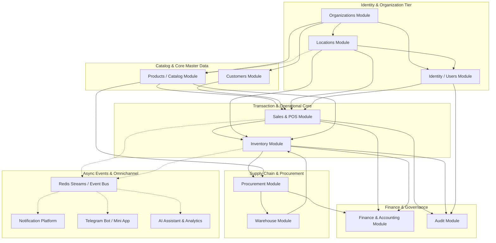

# Dependency Map — Universal Enterprise Business Platform

> **Document Version:** 2.0.0  
> **Status:** Architecture Blueprint & Integration Specification  
> **Applicable Specs:** Master Engineering Prompt §5, §7, §8, §13, §17, §101  
> **Note:** Module references describe the **NestJS legacy backend** architecture. These dependency patterns must be preserved when porting to the canonical Python/FastAPI backend.

---

## 1. Architectural Boundary Principles (Spec §8, §101)

1. **Strict Data Ownership:** Each module exclusively owns its persistence entities and database tables.
   - `products` module owns `products`, `product_variants`, `categories`, `brands`.
   - `sales` module owns `sales`, `sale_line_items`, `sale_payments`.
   - `inventory` module owns `inventory_items`, `stock_movements`.
   - `customers` module owns `customers`, `customer_addresses`.
   - `identity` module owns `users`, `roles`, `permissions`.
   - `organizations` module owns `organizations`, `locations`.
2. **Prohibited Cross-Module Persistence Mutation:** Direct SQL queries or Prisma model mutations across module boundaries are strictly forbidden.
3. **Communication Mechanisms:**
   - **Synchronous In-Process Communication:** Via typed Application Service interfaces / Dependency Injection within the same modular monolith process.
   - **Asynchronous Decoupled Communication:** Via Domain Events (Redis Streams / BullMQ worker queues).

---

## 2. Master Module Dependency Graph

---

## 3. Critical Execution Flow: Sales Transaction Execution

The Sales checkout flow illustrates how modular boundaries, data ownership, and atomicity are preserved:

```mermaid
sequenceDiagram
    autonumber
    actor Client as POS / Web Client
    participant SC as SalesController
    participant SS as SalesService
    participant PS as ProductService / Cache
    participant DB as PostgreSQL (Atomic Tx)
    participant IS as InventoryService
    participant AS as AuditService
    participant EB as Redis Streams (Event Bus)

    Client->>SC: POST /api/v1/sales (Items, Payments, IdempotencyKey)
    SC->>SS: createSale(orgId, userId, dto)
    
    rect rgb(30, 41, 59)
        Note over SS: 1. Idempotency Check
        SS->>DB: Query sale by idempotencyKey
    end

    rect rgb(30, 41, 59)
        Note over SS: 2. Server-Side Price & Tax Lookup
        SS->>PS: Get active variants for variantIds
        PS-->>SS: Verified prices, units, and tax rates
        Note over SS: Recalculate line totals, discounts, taxes, and grand total
        Note over SS: Validate that payments cover grand total
    end

    rect rgb(15, 23, 42)
        Note over SS,DB: 3. Atomic Database Transaction
        SS->>DB: BEGIN TRANSACTION
        SS->>DB: INSERT into sales
        SS->>DB: INSERT into sale_line_items (immutable snapshots)
        SS->>DB: INSERT into sale_payments
        SS->>IS: Decrement stock for each line item
        IS->>DB: UPSERT inventory_items (decrement stockOnHand)
        IS->>DB: INSERT stock_movements (type: SALE, balanceAfter)
        SS->>DB: COMMIT TRANSACTION
    end

    rect rgb(30, 41, 59)
        Note over SS,AS: 4. Compliance Audit & Event Dispatch
        SS->>AS: record({ action: 'SALE_COMPLETED', saleId })
        SS--)EB: Publish SALE_COMPLETED event (async)
    end

    SS-->>SC: Return SaleDto
    SC-->>Client: 201 Created (Envelope with requestId)
```

---

## 4. Cross-Module Dependency Matrix

| Source Module | Target Module | Interaction Type | Mechanism | Justification |
|---|---|---|---|---|
| `Sales` | `Products` | Synchronous | `ProductRepository.findManyByIds` | Mandatory server-side price & tax verification |
| `Sales` | `Inventory` | Synchronous / In-Tx | `InventoryService.decrementStock` | Atomic inventory reservation / depletion |
| `Sales` | `Customers` | Synchronous | `CustomerRepository.findById` | Customer attachment & credit verification |
| `Sales` | `Audit` | Non-blocking / Safe | `AuditService.record` | Append-only regulatory audit logging |
| `Sales` | `Notifications` | Asynchronous | Redis Stream (`SALE_COMPLETED`) | Customer receipt delivery (Telegram / Email) |
| `Inventory` | `Audit` | Non-blocking / Safe | `AuditService.record` | Audit logging of manual adjustments & counts |
| `Inventory` | `Notifications` | Asynchronous | Redis Stream (`STOCK_LOW`) | Automated low-stock alerts to procurement |
| `Procurement` | `Inventory` | Synchronous / In-Tx | `InventoryService.incrementStock` | Stock increment on goods receipt confirmation |
| `Procurement` | `Finance` | Asynchronous / Event | Redis Stream (`PO_APPROVED`) | Accounts Payable liability creation |
| `Finance` | `Sales` | Read-only | `SalesQueryService.getPeriodTotals` | Financial period reconciliation & revenue |

---

## 5. Failure Domain Isolation & Graceful Degradation

1. **Audit Logging Isolation:** A failure to write to `audit_logs` is logged via NestJS Logger but **never rolls back the primary business transaction**.
2. **Notification Isolation:** Notification dispatch runs in background worker queues (BullMQ). If email or Telegram gateways fail, the transaction remains completed, and exponential backoff retry handles delivery.
3. **Telemetry & Metrics Isolation:** Prometheus metrics and OpenTelemetry traces run in-memory and asynchronously; failures cannot impact HTTP request handling.
4. **Tenant Isolation:** If a query fails or throws within one tenant context, other tenant requests continue uninterrupted.
