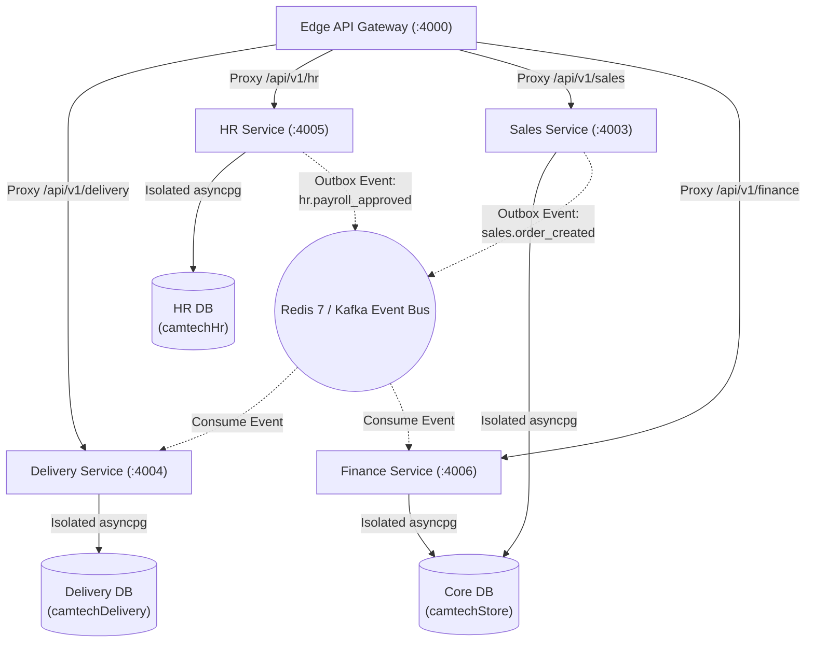

# Phase 5 Architecture Blueprint: Per-Service Database Extraction & Asynchronous Saga Synchronization

> **Standard:** Cloud-Native Domain-Driven Design (DDD) & Event-Driven Microservices (2026–2030)  
> **Precondition:** Adopted when domain write throughput or organizational team scaling warrants physical deployment isolation for Delivery and HR domains.

---

## 1. Domain Separation Overview

In the current architecture, all 7 microservices share a high-performance PostgreSQL 16 instance with transactional ACID boundaries. Phase 5 provides the blueprint for decomposing **Delivery** and **HR & Payroll** into standalone, physically isolated database clusters.



---

## 2. Delivery Domain Extraction (`camtechDelivery`)

### Owned Tables
1. `deliveries` (Shipment state aggregate root)
2. `delivery_tracking` (GPS telemetry, coordinates, timestamps)
3. `drivers` (Driver profiles, vehicles, active shifts)
4. `delivery_zones` (Geographic geofences, dispatch routing)
5. `proof_of_delivery` (Signatures, recipient photos, timestamps)

### Cross-Service Interaction (Saga Orchestration)
Instead of a direct relational join to `orders` and `customers`:
- When a checkout occurs, Sales emits `sales.order_created` with customer coordinates, item dimensions, and delivery address.
- Delivery service ingests `sales.order_created`, persists a local delivery record, and dispatches to the nearest driver.
- Upon successful delivery, Delivery emits `delivery.completed` with signature URL and COD payment confirmation.
- Sales updates order status to `COMPLETED` and emits `sales.order_settled`.

---

## 3. HR & Payroll Domain Extraction (`camtechHr`)

### Owned Tables
1. `departments` (Organizational tree, hierarchies)
2. `employees` (Staff records, positions, contracts, base salaries)
3. `payrolls` (Payroll runs, deductions, taxes, net wages)
4. `attendance` (Timecards, clock-in/out stamps)
5. `leave_requests` (Time-off balances and approvals)

### Cross-Service Interaction (Saga Orchestration)
Instead of direct relational joins to `users` and `journal_entries`:
- When an HR manager executes a payroll run:
  1. HR computes allowances, taxes, and net disbursements.
  2. HR emits `hr.payroll_approved` containing the double-entry accounting payload (debit salaries expense, credit withholding tax liability, credit cash/bank account).
  3. Finance Service consumes `hr.payroll_approved` idempotently and posts the General Journal entry atomically into the core ledger.
  4. Finance emits `finance.journal_posted` confirming settlement.

---

## 4. Message Contracts & Outbox Invariants

Every cross-service event must satisfy the canonical envelope:

```json
{
  "eventId": "evt_01J0A8B7C9D8E7F6A5B4C3D2",
  "eventType": "sales.order_created",
  "aggregateId": "sale_7f8a9b0c-1234-5678-9abc-def012345678",
  "timestamp": "2026-09-06T14:45:00.000Z",
  "traceparent": "00-4bf92f3577b34da6a3ce929d0e0e4736-00f067aa0ba902b7-01",
  "payload": {
    "orderId": "sale_7f8a9b0c-...",
    "organizationId": "cmtk8h18o0000vkd0etmdacgw",
    "deliveryAddress": "Phnom Penh, Cambodia",
    "recipientPhone": "+85512345678",
    "grandTotal": 149.99,
    "paymentMethod": "BAKONG_KHQR"
  }
}
```

### Invariants:
1. **At-Least-Once Delivery:** Guaranteed by PostgreSQL transactional Outbox table (`outbox_events`).
2. **Idempotent Consumers:** Consumers verify `eventId` in local `processed_events` table before applying state mutations.
3. **Dead Letter Queue (DLQ):** Failed events after 5 exponential backoff retries transition to `failed_events` for manual operator replay.
