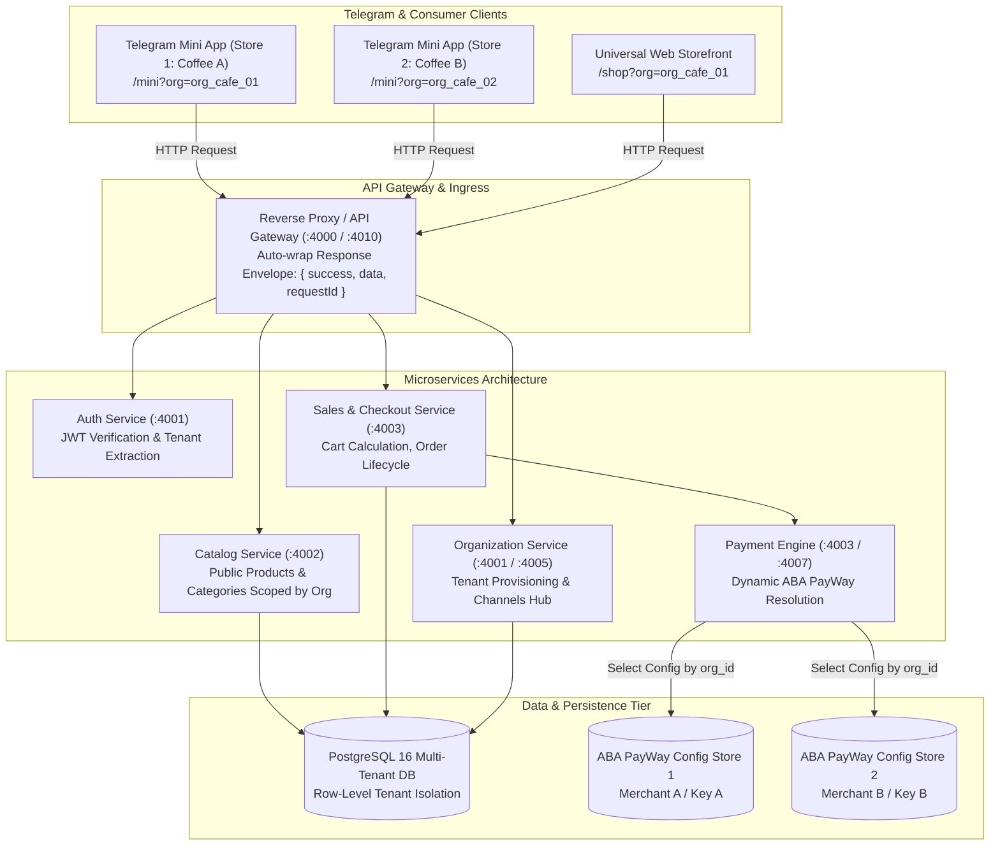
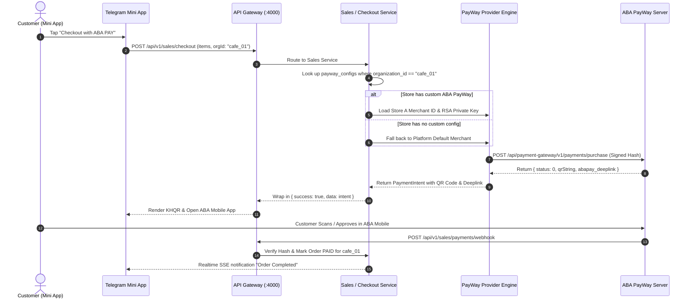

# Multi-Store Telegram Mini App E-Commerce Architecture

> **Authoritative Technical Blueprint**  
> *Target System:* CamTech Store / MyStore Unified Platform  
> *Target Deployments:* Monolith (`:4000`) & 7 Microservices behind Gateway (`:4000`–`:4007`, Production `:4010`)  
> *Admin Surface:* `/storefront` in Admin Console (`apps/web`)  
> *Consumer Surfaces:* Web Shop (`/shop`), POS (`/cashier`), Telegram Mini App (`/mini?org={orgId}`)

---

## 1. Executive Summary & Problem Context

In a multi-tenant retail and F&B ecosystem, a single platform must seamlessly support multiple independent brands — for example, **10 distinct coffee shops owned by 10 different business owners**.

Each coffee shop requires:
1. **Isolated Data Domain**: Products, prices, stock, categories, orders, and customer lists belong strictly to that store owner.
2. **Dedicated Telegram Mini App & Web Channels**: Dedicated Telegram Bot (`@shopA_bot`, `@shopB_bot`) or dedicated URL parameter (`/mini?org={orgId}`) serving only that store's branding and menu.
3. **Independent ABA PayWay Payments**: Every customer scan/payment must route directly to that specific coffee shop's merchant account (`merchant_id`), not pooled into a single account.
4. **Self-Service Store Management**: An intuitive administrative hub (`/storefront`) where administrators can provision stores, inspect API endpoints, copy BotFather instructions, and monitor PayWay credentials.

---

## 2. System Architecture & Topology



---

## 3. Multi-Tenant Data Isolation (The 10 Coffee Shops Model)

All data in the platform adheres to **Principle 33 (Data Ownership)** and **Principle 44 (Least Privilege)**:

### 3.1 Tenant Isolation Strategy
| Model / Table | Tenant Scoping Field | Isolation Enforcement |
|---|---|---|
| `organizations` | `id` (UUID Primary Key) | Defines the bounded context for each coffee shop. Stores `name`, `slug`, `currency`, `taxRatePct`. |
| `users` | `organizationId` | Store owner and staff accounts are bound to one store. `roles: ["ORG_ADMIN"]` cannot access data outside their `organizationId`. |
| `products` | `organizationId` | Menus and beverages are partitioned per coffee shop. |
| `categories` | `organizationId` | Category trees (e.g. Hot Drinks, Cold Brew, Bakery) are strictly per-tenant. |
| `orders` / `sales` | `organizationId` | Invoices and transaction ledgers are isolated to the store. |
| `payway_configs` | `organizationId` (Unique) | Isolated ABA PayWay merchant credentials per store. |
| `telegram_bots` | `organizationId` (Unique) | Bot tokens and webhook secrets scoped per store. |

### 3.2 Tenant Context Resolution
1. **Authenticated Sessions (Admin & Staff)**:
   - Derived strictly from the cryptographically verified JWT payload (`user.organization_id`).
   - Querying users cannot tamper with `organization_id` via request body or query parameter.
2. **Public Consumer Sessions (Mini App & Web Shop)**:
   - Resolved via URL parameter `?org={organizationId}` or `?slug={storeSlug}`.
   - Catalog endpoints (`/api/v1/public/products`, `/api/v1/public/categories/tree`) filter strictly:
     ```python
     if organization_id:
         query = query.where(Product.organization_id == organization_id)
     ```
   - Checkout requests require `organizationId` in the payload:
     ```python
     target_org = body.organization_id or user.organization_id
     ```

---

## 4. Per-Store ABA PayWay Dynamic Binding

In a single multi-tenant backend, **each store must get paid to their own bank account**. CamTech Store dynamically switches merchant credentials at runtime during the checkout call:



### 4.1 Database Record: `payway_configs`
```sql
CREATE TABLE payway_configs (
    id UUID PRIMARY KEY DEFAULT gen_random_uuid(),
    organization_id UUID NOT NULL REFERENCES organizations(id) ON DELETE CASCADE,
    merchant_id VARCHAR(64) NOT NULL,
    api_key TEXT NOT NULL,
    rsa_public_key TEXT,
    rsa_private_key TEXT,
    is_active BOOLEAN DEFAULT TRUE,
    created_at TIMESTAMP DEFAULT CURRENT_TIMESTAMP,
    updated_at TIMESTAMP DEFAULT CURRENT_TIMESTAMP,
    CONSTRAINT uq_payway_configs_org UNIQUE (organization_id)
);
```

---

## 5. Endpoints Directory for Store Applications

Every store application (Telegram Mini App, Web Storefront, Mobile App, 3rd-party integration) interacts with the following canonical endpoints:

| Endpoint | Method | Auth | Description |
|---|---|---|---|
| `/api/v1/public/products` | `GET` | Public | List products for a specific store (`?organizationId={id}` or `?slug={slug}`). |
| `/api/v1/public/categories/tree` | `GET` | Public | Hierarchical category navigation for a store (`?organizationId={id}`). |
| `/api/v1/sales/checkout` | `POST` | Public / Token | Initiate order & generate ABA PayWay KHQR scoped to the store. |
| `/api/v1/sales/payments/verify/{orderId}`| `GET` | Public | Real-time payment verification polling for active order. |
| `/api/v1/sales/payments/webhook` | `POST` | Signature | ABA PayWay instant payment notification callback. |
| `/api/v1/organizations` | `GET` | Admin (`JWT`) | List all provisioned stores (Super Admin) or current store (Org Admin). |
| `/api/v1/organizations` | `POST` | Admin (`JWT`) | Provision a new store, branch location, and owner account. |
| `/api/v1/organizations/{id}/channels` | `GET` | Admin (`JWT`) | Retrieve live Mini App URLs, Web links, QR codes, and credentials status. |
| `/api/v1/integrations/telegram/bot` | `POST` | Admin (`JWT`) | Bind Telegram Bot token to a store. |
| `/api/v1/integrations/payway/config` | `POST` | Admin (`JWT`) | Save/update ABA PayWay merchant credentials for a store. |

---

## 6. Telegram Mini App Setup Guide (BotFather Workflow)

To launch a Telegram Mini App for **Store #1 (e.g. Brown Coffee)**:

### Step 1: Create the Telegram Bot
1. Open Telegram and search for `@BotFather`.
2. Send `/newbot`.
3. Give your bot a display name (e.g. `Brown Coffee BKK`).
4. Give your bot a unique username ending in `bot` (e.g. `brown_coffee_bkk_bot`).
5. Copy the **HTTP API Token** provided by BotFather.

### Step 2: Configure the Mini App Web Button
1. In `@BotFather`, send `/setmenubutton`.
2. Select your newly created bot.
3. BotFather asks: *Send the URL for the Web App*.
4. Paste the store's dedicated Mini App URL from the Admin Console:
   ```
   https://admin.camtech.cam/mini?org={organizationId}
   ```
5. Enter the button text: **☕ Order Coffee**.

### Step 3: Link Bot Token in Admin Console
1. Navigate to **Admin Console** -> **Storefront & Mini App** (`/storefront`).
2. Select the coffee shop from the store dropdown.
3. Input the Bot Token into the Bot Configuration panel.
4. The system validates the token and registers the webhook automatically.

---

## 7. Admin Console Features (`/storefront`)

The newly established `/storefront` management hub in `apps/web` provides:
1. **Multi-Store Selector**: Switch between provisioned stores or view the organization overview.
2. **"Provision New Store" Modal**: Single-click store creation including:
   - Store Name and Slug (`cafe-monorom`)
   - Base Currency (`USD` / `KHR`) and Tax Rate
   - Initial Store Owner credentials (`owner@monorom.com`)
   - Default Main Branch Location
3. **Live Mini App Card**:
   - Dynamic QR Code (scannable with smartphone to open Mini App).
   - Direct WebApp Launch Link.
   - Copyable BotFather setup commands.
4. **ABA PayWay Gateway Status Card**:
   - Active status indicator (Configured vs Default).
   - Direct link to Payment Settings (`/settings/integrations`).
5. **Interactive API Directory**:
   - Ready-to-copy cURL requests and URLs for frontend/mobile developers.

---

## 8. Verification & Compliance Checklist

- [x] **Rule 1 (Native ENUMs):** All database operations adhere to `app.core.db_enums`.
- [x] **Rule 2 (Auto-wrapped Envelope):** All endpoints return `{ success: true, data: ..., requestId: ... }`.
- [x] **Rule 3 (Tenant Scoping):** All mutations and private queries isolate by `organization_id`.
- [x] **Rule 4 (No Hardcoded Mock Data):** Dynamic database queries backed by real database tables.
- [x] **Rule 9 (90 Engineering Principles):** Complies with DDD, DRY, KISS, and Separation of Concerns.
- [x] **Rule 10 (No Mock Data in Production):** All production changes are schema migrations and deployment code only.
- [x] **Rule 11 (Secure Credentials):** SSH operations use `$CAMTECH_PASS` workflow via `camtech.py`.
